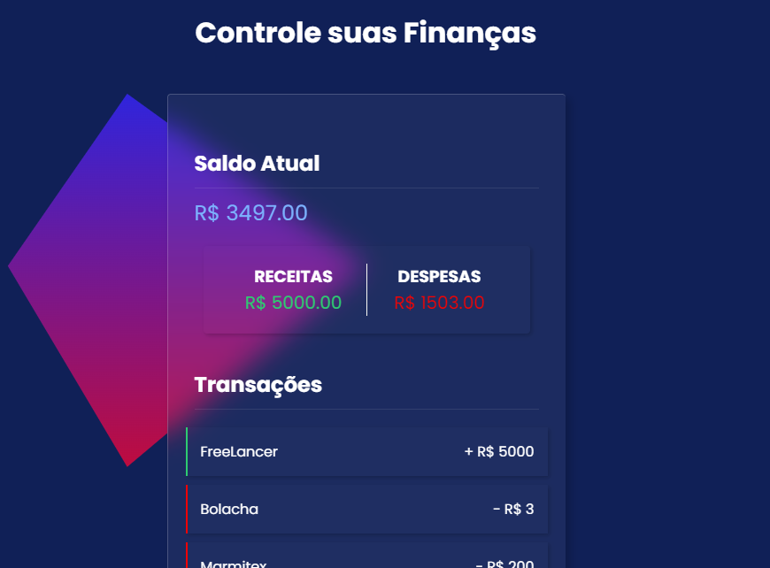

# Controle Financeiro
 

    

 

#
 

 Objetivo do projeto foi aprender e melhorar a parte do javascript como as funções com arrow functions, reduce, map, filter e Local Storage e outras funções, além de melhorar um pouco mais no css. 
Basicamente um aplicativo financeiro que você faz a inserção de uma entrada de renda e despesas, você pode remover os itens jogando na lixeira.
